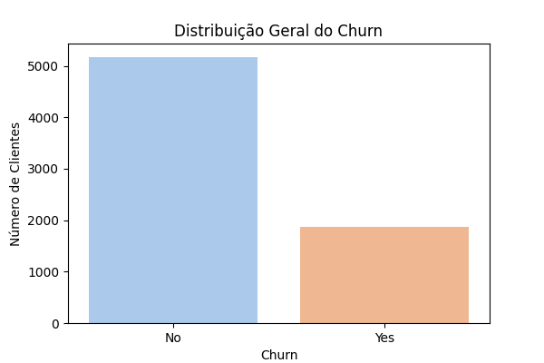
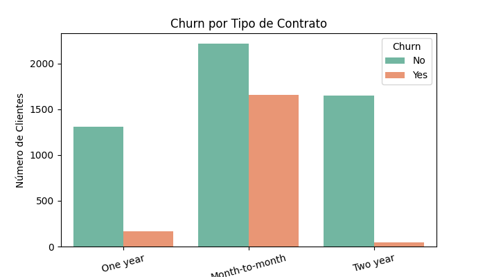
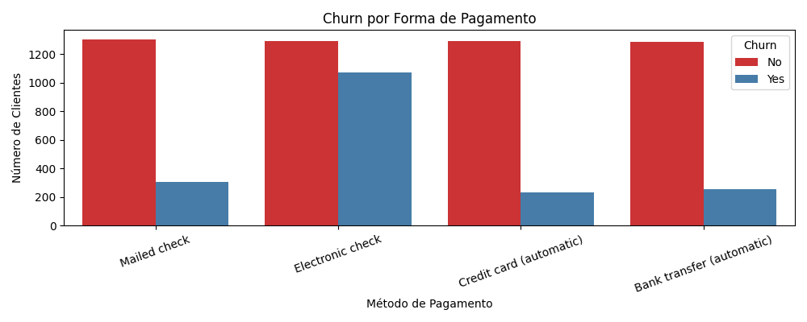
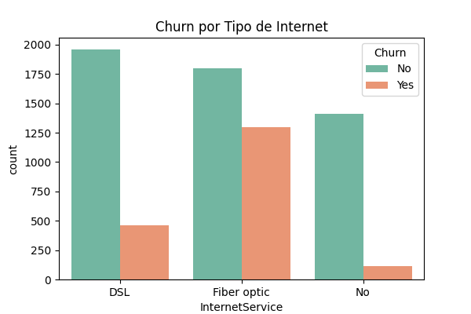
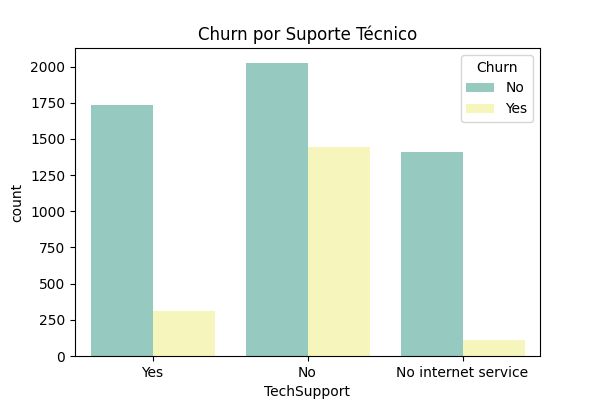
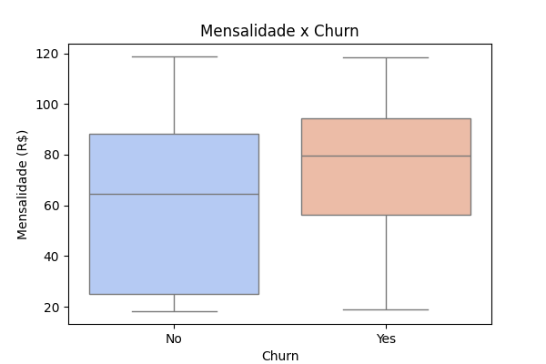
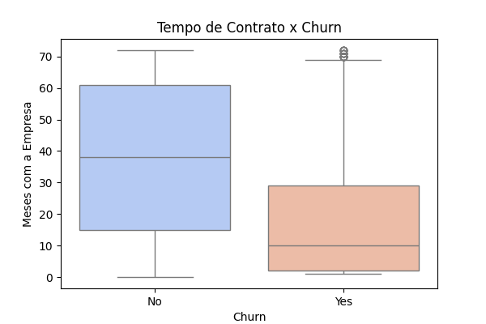

# Telecom X – Análise de Evasão de Clientes (Churn)

Projeto desenvolvido como parte do Desafio de Data Science do Programa ONE/Alura. O objetivo é analisar dados da Telecom X para identificar padrões de cancelamento (churn) e propor estratégias de retenção.

---

## 🎯 Objetivo

Aplicar técnicas de ETL (Extração, Transformação e Carga) e EDA (Análise Exploratória de Dados) para gerar insights estratégicos a partir dos dados da empresa Telecom X.

---

## 🔄 Processo de ETL

### Extração
- Fonte: API pública no GitHub (formato JSON)

### Transformação
- Expansão de colunas com dicionários (customer, internet, account)
- Tratamento de nulos e tipos de dados
- Criação do DataFrame final `df_final`

---

## 📊 Análise Exploratória de Dados (EDA)

### Distribuição Geral do Churn

### Churn por Tipo de Contrato

### Churn por Forma de Pagamento

### Churn por Tipo de Internet

### Churn por Suporte Técnico

### Mensalidade x Churn

### Tempo de Contrato x Churn

---

## 🔍 Principais Insights

- Contratos mensais têm maior churn
- Pagamentos via `electronic check` estão associados a mais cancelamentos
- Clientes com internet por fibra e sem suporte técnico cancelam mais
- Valores mais altos de mensalidade também se relacionam ao churn
- Churn é mais alto nos primeiros meses de relacionamento

---

## ✅ Conclusão

A análise evidenciou variáveis críticas associadas ao churn. Recomendam-se ações focadas em:

- Migrar clientes para contratos longos com incentivos
- Estimular pagamentos automáticos
- Melhorar o valor percebido dos serviços mais caros
- Engajar clientes no início da jornada com suporte e benefícios

---

## 🛠 Tecnologias utilizadas

- Python 3.11
- Pandas
- Seaborn
- Matplotlib
- Google Colab

---

## 📁 Estrutura do Projeto
telecom-x-churn-analysis/
├── imgs/ # Pasta com os gráficos gerados durante a EDA
│ ├── churn_by_contract.png
│ ├── churn_by_payment.png
│ ├── churn_by_internet.png
│ ├── churn_by_monthlycharges.png
│ ├── churn_by_techsupport.png
│ ├── churn_by_tenure.png
│ └── churn_dist.png
├── telecom-x-churn-analysis.ipynb # Notebook com todo o processo de ETL e EDA
├── README.md # Documentação do projeto
